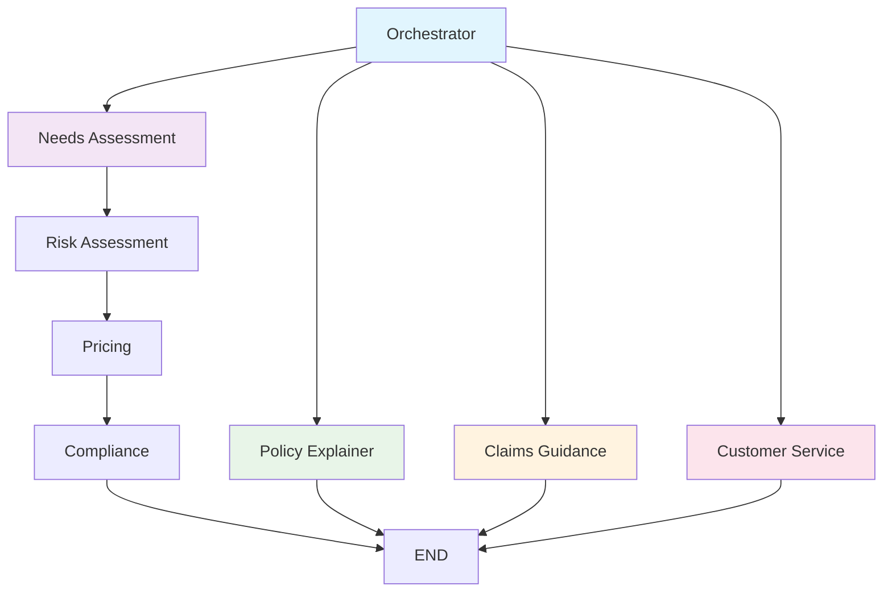

# LangGraph Agents Documentation

## Overview

The ConvoTravelInsure platform uses LangGraph to orchestrate conversational AI agents that handle different aspects of the travel insurance process. The system is designed as a state machine with multiple nodes that can route conversations based on user intent and context.

## Architecture

### State Machine Design

The conversation system is built as a directed graph where each node represents a specific capability or decision point. The graph routes conversations based on user intent and collected information.



### Node Descriptions

#### 1. Orchestrator
- **Purpose**: Routes conversations based on user intent
- **Input**: User message, conversation history
- **Output**: Intent classification, confidence score, routing decision
- **Logic**: Uses simple keyword matching (TODO: Replace with proper NLP)

#### 2. Needs Assessment
- **Purpose**: Collects trip information for quotes
- **Input**: User message, existing trip data
- **Output**: Updated trip information, missing data requests
- **Logic**: Extracts structured data from natural language

#### 3. Risk Assessment
- **Purpose**: Evaluates risk factors for pricing
- **Input**: Trip details, traveler information, activities
- **Output**: Risk breakdown, risk scores
- **Logic**: Calculates risk based on age, activities, destinations

#### 4. Pricing
- **Purpose**: Calculates insurance pricing
- **Input**: Trip details, risk factors
- **Output**: Price range or firm price, breakdown
- **Logic**: Uses insurer adapter to calculate pricing

#### 5. Policy Explainer
- **Purpose**: Answers questions about policy coverage
- **Input**: User question, policy context
- **Output**: Policy explanation with citations
- **Logic**: Uses RAG to search policy documents

#### 6. Claims Guidance
- **Purpose**: Helps users with claims process
- **Input**: Claim type, user context
- **Output**: Requirements, checklist, guidance
- **Logic**: Provides step-by-step claims assistance

#### 7. Compliance
- **Purpose**: Handles legal and compliance requirements
- **Input**: User consent, policy details
- **Output**: Compliance confirmation, disclosures
- **Logic**: Ensures regulatory compliance

#### 8. Customer Service
- **Purpose**: Handles escalations and human handoff
- **Input**: User request, conversation context
- **Output**: Handoff request, human agent connection
- **Logic**: Creates handoff requests when needed

## State Management

### Conversation State

```python
class ConversationState(TypedDict):
    """State for conversation graph."""
    messages: List[BaseMessage]
    user_id: str
    current_intent: str
    collected_slots: Dict[str, Any]
    confidence_score: float
    requires_human: bool
    quote_data: Dict[str, Any]
    policy_question: str
    claim_type: str
    handoff_reason: str
```

### State Transitions

The system uses a state machine approach where each node can modify the state and determine the next node to execute.

```python
def should_continue(state: ConversationState) -> str:
    """Determine next step in conversation."""
    
    intent = state.get("current_intent")
    
    if state.get("requires_human"):
        return "customer_service"
    
    if intent == "quote":
        if not state.get("collected_slots"):
            return "needs_assessment"
        elif not state.get("quote_data"):
            return "risk_assessment"
        else:
            return "pricing"
    elif intent == "policy_explanation":
        return "policy_explainer"
    elif intent == "claims_guidance":
        return "claims_guidance"
    elif intent == "human_handoff":
        return "customer_service"
    else:
        return "customer_service"
```

## Tools Integration

### Conversation Tools

Each agent node has access to a set of tools that provide specific capabilities:

```python
class ConversationTools:
    """Tools available to conversation agents."""
    
    def __init__(self, db: Session):
        self.db = db
        self.pricing_service = PricingService()
        self.rag_service = RagService()
        self.claims_service = ClaimsService()
        self.handoff_service = HandoffService()
    
    def get_quote_range(self, ...) -> Dict[str, Any]:
        """Get quote price range."""
        pass
    
    def get_firm_price(self, ...) -> Dict[str, Any]:
        """Get firm price for a quote."""
        pass
    
    def search_policy_documents(self, ...) -> Dict[str, Any]:
        """Search policy documents for information."""
        pass
    
    def get_claim_requirements(self, ...) -> Dict[str, Any]:
        """Get claim requirements for a claim type."""
        pass
    
    def create_handoff_request(self, ...) -> Dict[str, Any]:
        """Create a human handoff request."""
        pass
```

## Intent Classification

### Current Implementation

The system currently uses simple keyword matching for intent classification:

```python
def orchestrator(state: ConversationState) -> ConversationState:
    """Route conversation based on intent and confidence."""
    
    last_message = state["messages"][-1]
    user_input = last_message.content.lower()
    
    # Simple intent detection (TODO: Replace with proper NLP)
    if any(word in user_input for word in ["quote", "price", "cost", "insurance"]):
        state["current_intent"] = "quote"
        state["confidence_score"] = 0.8
    elif any(word in user_input for word in ["policy", "coverage", "what does"]):
        state["current_intent"] = "policy_explanation"
        state["confidence_score"] = 0.7
    elif any(word in user_input for word in ["claim", "file", "submit"]):
        state["current_intent"] = "claims_guidance"
        state["confidence_score"] = 0.8
    elif any(word in user_input for word in ["human", "agent", "help", "support"]):
        state["current_intent"] = "human_handoff"
        state["confidence_score"] = 0.9
    else:
        state["current_intent"] = "general_inquiry"
        state["confidence_score"] = 0.5
    
    return state
```

### Future Enhancement

The intent classification should be enhanced with proper NLP models:

```python
def enhanced_orchestrator(state: ConversationState) -> ConversationState:
    """Enhanced intent classification with NLP."""
    
    last_message = state["messages"][-1]
    user_input = last_message.content
    
    # Use LLM for intent classification
    intent_prompt = f"""
    Classify the user's intent from the following message:
    
    Message: "{user_input}"
    
    Available intents:
    - quote: User wants to get a travel insurance quote
    - policy_explanation: User has questions about policy coverage
    - claims_guidance: User needs help with claims
    - human_handoff: User wants to speak to a human agent
    - general_inquiry: General questions or unclear intent
    
    Return the intent and confidence score (0-1).
    """
    
    # TODO: Implement LLM-based classification
    intent_result = llm_classify_intent(intent_prompt)
    
    state["current_intent"] = intent_result["intent"]
    state["confidence_score"] = intent_result["confidence"]
    
    return state
```

## Error Handling

### Graceful Degradation

The system is designed to gracefully handle errors and fall back to human assistance when needed:

```python
def handle_node_error(node_name: str, error: Exception, state: ConversationState) -> ConversationState:
    """Handle errors in conversation nodes."""
    
    logger.error(f"Error in {node_name}: {str(error)}")
    
    # Set low confidence to trigger human handoff
    state["confidence_score"] = 0.3
    state["requires_human"] = True
    
    # Add error message to conversation
    error_message = AIMessage(
        content="I'm having trouble processing your request. Let me connect you with a human agent who can help."
    )
    state["messages"].append(error_message)
    
    return state
```

### Retry Logic

For transient failures, the system implements retry logic:

```python
def retry_node_execution(node_func, state: ConversationState, max_retries: int = 3) -> ConversationState:
    """Retry node execution with exponential backoff."""
    
    for attempt in range(max_retries):
        try:
            return node_func(state)
        except Exception as e:
            if attempt == max_retries - 1:
                return handle_node_error(node_func.__name__, e, state)
            
            # Exponential backoff
            time.sleep(2 ** attempt)
    
    return state
```

## Monitoring and Analytics

### Conversation Metrics

The system tracks various metrics for monitoring and improvement:

```python
class ConversationMetrics:
    """Metrics for conversation monitoring."""
    
    def __init__(self):
        self.total_conversations = 0
        self.successful_conversations = 0
        self.human_handoffs = 0
        self.intent_accuracy = {}
        self.node_performance = {}
    
    def record_conversation_start(self, user_id: str):
        """Record conversation start."""
        self.total_conversations += 1
    
    def record_conversation_success(self, user_id: str, intent: str):
        """Record successful conversation."""
        self.successful_conversations += 1
        self.intent_accuracy[intent] = self.intent_accuracy.get(intent, 0) + 1
    
    def record_human_handoff(self, user_id: str, reason: str):
        """Record human handoff."""
        self.human_handoffs += 1
    
    def record_node_performance(self, node_name: str, duration: float, success: bool):
        """Record node performance."""
        if node_name not in self.node_performance:
            self.node_performance[node_name] = {
                'total_calls': 0,
                'successful_calls': 0,
                'avg_duration': 0
            }
        
        metrics = self.node_performance[node_name]
        metrics['total_calls'] += 1
        if success:
            metrics['successful_calls'] += 1
        
        # Update average duration
        metrics['avg_duration'] = (
            (metrics['avg_duration'] * (metrics['total_calls'] - 1) + duration) / 
            metrics['total_calls']
        )
```

## Testing

### Unit Tests

```python
import pytest
from app.agents.graph import create_conversation_graph
from app.agents.tools import ConversationTools

class TestConversationGraph:
    def test_orchestrator_intent_classification(self):
        """Test intent classification in orchestrator."""
        graph = create_conversation_graph(mock_db)
        
        state = {
            "messages": [HumanMessage(content="I need a travel insurance quote")],
            "user_id": "test-user",
            "current_intent": "",
            "collected_slots": {},
            "confidence_score": 0.0,
            "requires_human": False
        }
        
        result = graph.nodes["orchestrator"](state)
        
        assert result["current_intent"] == "quote"
        assert result["confidence_score"] > 0.5
    
    def test_needs_assessment_slot_collection(self):
        """Test slot collection in needs assessment."""
        graph = create_conversation_graph(mock_db)
        
        state = {
            "messages": [HumanMessage(content="I'm traveling to France for 7 days")],
            "user_id": "test-user",
            "current_intent": "quote",
            "collected_slots": {},
            "confidence_score": 0.8,
            "requires_human": False
        }
        
        result = graph.nodes["needs_assessment"](state)
        
        assert "destinations" in result["collected_slots"]
        assert "France" in result["collected_slots"]["destinations"]
```

### Integration Tests

```python
@pytest.mark.integration
class TestConversationIntegration:
    def test_full_quote_conversation(self):
        """Test complete quote conversation flow."""
        graph = create_conversation_graph(test_db)
        
        # Start conversation
        state = {
            "messages": [HumanMessage(content="I need travel insurance")],
            "user_id": "test-user",
            "current_intent": "",
            "collected_slots": {},
            "confidence_score": 0.0,
            "requires_human": False
        }
        
        # Run through conversation flow
        result = graph.invoke(state)
        
        # Verify final state
        assert result["current_intent"] == "quote"
        assert "quote_data" in result
        assert result["quote_data"]["price_range"] is not None
```

## Future Enhancements

### 1. Advanced NLP Integration

- Replace keyword matching with proper NLP models
- Implement sentiment analysis for better user understanding
- Add multilingual support

### 2. Context Awareness

- Maintain conversation context across sessions
- Implement user preference learning
- Add personalized recommendations

### 3. Multi-Modal Support

- Integrate voice input/output
- Support image and document uploads
- Implement video call capabilities

### 4. Advanced Routing

- Implement dynamic routing based on conversation flow
- Add conditional branching logic
- Support parallel node execution

### 5. Learning and Improvement

- Implement conversation outcome tracking
- Add A/B testing for different conversation flows
- Continuous learning from user interactions
